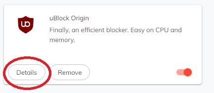
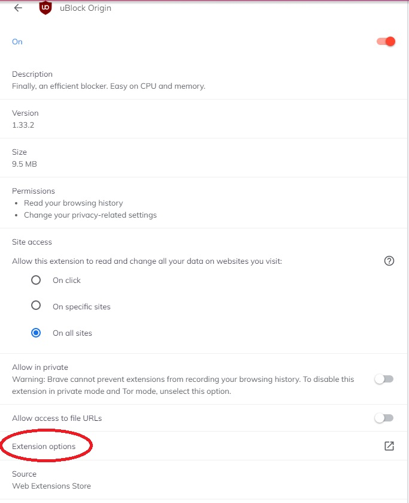
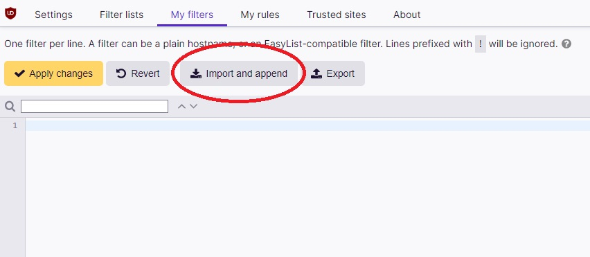

# uBlock Origin: Custom Filters
> List of custom filters to bypass intrusive paywall modals implemented on various sites.

## What is this?

This repository is home to filters for [uBlock Origin] (https://ublockorigin.com/), an open source ad content blocker.

Currently the filters are focused on bypassing paywall modal windows for news sites. 

## Installation and Usage

Please install [uBlock Origin] (https://ublockorigin.com/) for the appropriate browser.

Once installed, navigate to the extensions tab 
* [Brave] (brave://extensions/)
* [Chrome] (chrome://extensions/)

Click on the **Details** tab

Click on the **Extension options** tab

Navigate to **My filters** and use **Import and append** to append the *filter.txt* file found within the repository into the filter list.

Click **Apply Changes** to save the filter list.